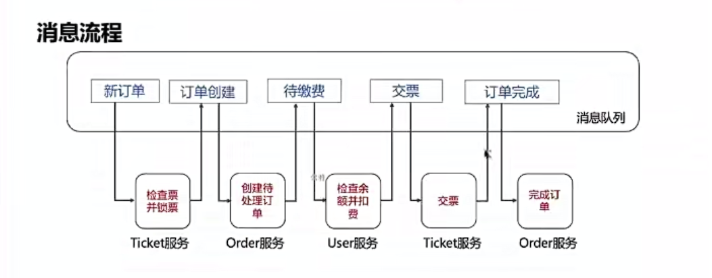

## 周边
``` shell
# nacos
.\startup.cmd -m standalone

# sentinal
java -Dserver.port=8070 -Dcsp.sentinel.dashboard.server=localhost:8070 -Dproject.name=sentinel-dashboard -jar sentinel-dashboard-1.8.4.jar
```

## 创建订单

### 表结构
``` sql
CREATE TABLE `consumer` (
   `id` bigint(30) NOT NULL,
   `username` varchar(100) NOT NULL COMMENT '用户名',
   `password` varchar(100) DEFAULT NULL COMMENT '密码',
   `role` varchar(100) DEFAULT NULL COMMENT '角色',
   `deposit` bigint(30) DEFAULT '0' COMMENT '余额',
   PRIMARY KEY (`id`)
 ) ENGINE=InnoDB DEFAULT CHARSET=utf8mb4 COMMENT='消费用户表';
 
CREATE TABLE `orders` (
   `id` bigint(30) NOT NULL,
   `uuid` varchar(100) NOT NULL COMMENT 'UUID 用于去重',
   `consumer_id` bigint(30) DEFAULT NULL COMMENT '消费者ID，表示订单时谁发起',
   `ticket_num` bigint(30) NOT NULL COMMENT '票号',
   `amount` bigint(30) NOT NULL COMMENT '金额',
   `status` int(2) NOT NULL COMMENT '订单状态',
   `reason` varchar(30) DEFAULT NULL COMMENT '原因',
   `create_date` datetime DEFAULT NULL COMMENT '创建时间',
   `title` varchar(150) DEFAULT NULL COMMENT 'title',
   PRIMARY KEY (`id`)
 ) ENGINE=InnoDB DEFAULT CHARSET=utf8mb4 COMMENT='订单表';
 
CREATE TABLE `ticket` (
   `id` bigint(30) NOT NULL,
   `name` varchar(100) NOT NULL COMMENT '姓名',
   `owner` bigint(30) DEFAULT NULL COMMENT '所有者',
   `ticket_num` bigint(30) NOT NULL COMMENT '票数',
   `lock_user` bigint(30) DEFAULT NULL COMMENT '锁票用户',
   PRIMARY KEY (`id`)
 ) ENGINE=InnoDB DEFAULT CHARSET=utf8mb4 COMMENT='票据表';

CREATE TABLE `consumer` (
   `id` bigint(30) NOT NULL,
   `username` varchar(100) NOT NULL COMMENT '用户名',
   `password` varchar(100) DEFAULT NULL COMMENT '密码',
   `role` varchar(100) DEFAULT NULL COMMENT '角色',
   `deposit` bigint(30) DEFAULT '0' COMMENT '余额',
   PRIMARY KEY (`id`)
 ) ENGINE=InnoDB DEFAULT CHARSET=utf8mb4 COMMENT='消费用户表';
```

### 发起订单
``` log
###
POST http://localhost:8001/api/order/create
Content-Type: application/json

{
  "consumerId": 1,
  "ticketNum": 1,
  "title":"test-1",
  "amount": 100
}
```



### 疑问

> 1、在消息传递的链条里面，上一步都是将下一步参数都是写到rabbitmq里面，还是说传递一个ID，由下一个服务通过openfeign去查？    
可以使用这种方式,也可以在消息落库之后,去直接查询落库的消息

> 2、假设执行中抛出未捕获的异常，是配置重试次数，将超过重试次数的消息写到死信队列里面？由其他服务监听死信队列通知到运维？    
这个时候业务中断了,可以当作分布式事务回滚处理

> 3、链条执行中执行过的消息要持久化吗？是持久化到数据库吗？  
链条中执行的消息是需要入库的，因为假设在没有入库的情况下。除却分布式事务业务流程中的开始节点和结束节点，中间节点的执行过程是丢失的，没有办法做后期排查和监控

> 4、在接受消息、幂等性、处理业务、发送消息的操作中，事务消息由于Base efforts 1pc,会出现落库rollback，但是消息发送出去了。但是由于下个操作依赖上个操作，那下个操作一定失败，这样整个流程其实已经走下去了   
在下个流程中会校验上个流程携带的参数，如果参数异常则整个业务回滚

> 5、在接受消息、幂等性、处理业务、发送消息的操作中，事务消息能不能改为手动ack，假设改为手动ack，那发送消息     
需要进行测试
